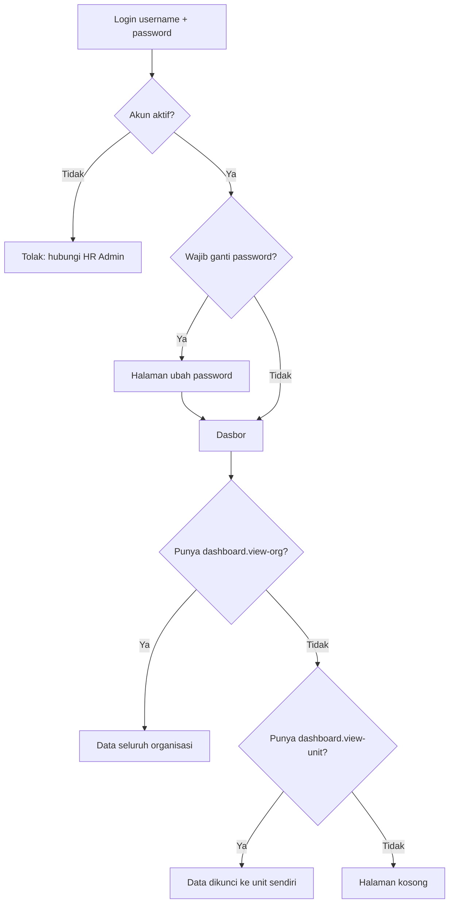
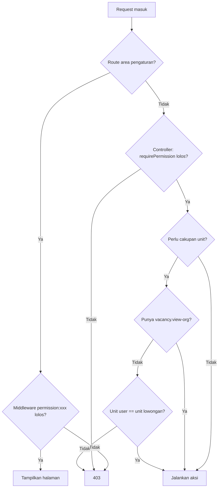
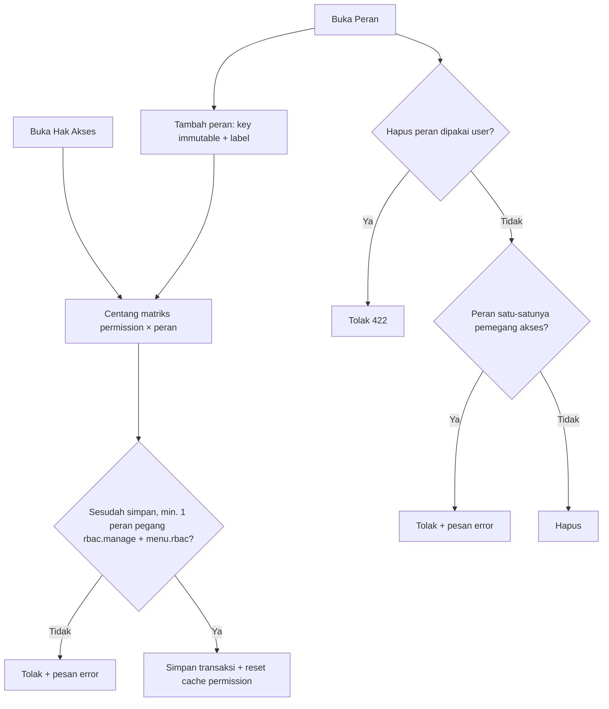
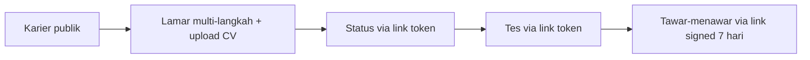

# RBAC Manual — ATS RS Azra

Sistem hak akses **tanpa package** (tanpa Spatie/Bouncer). Prinsip: **satu tombol / sidemenu = satu permission**.
Role dan permission murni **data di database** — tidak ada nama role yang di-hardcode di kode akses.

> Sumber teknis: `App\Support\Permissions` (katalog), `App\Support\InterviewStageMap`,
> `App\Models\Role`, `App\Models\Permission`, `App\Models\User::hasPermission()`.
> Total: **77 permission** dalam 18 grup.

## Daftar Peran (default)

Peran dikelola penuh lewat CRUD di **Peran** (`pengaturan/peran`) — tambah, ubah label, hapus.
`key` tidak bisa diubah setelah dibuat. Lima peran bawaan:

| Key | Label | Keterangan |
|---|---|---|
| `hr_admin` | Admin HR | Hampir semua akses (lihat pengecualian di bawah) |
| `hr_manager` | Manajer HR | Akses organisasi + nilai wawancara manajer |
| `unit_head` | Kepala Unit | Akses unit sendiri + skrining + nilai wawancara user |
| `director` | Direktur | Akses organisasi + nilai wawancara direktur |
| `employee` | Karyawan | Akses unit sendiri + profil sendiri |

Pengecualian: `hr_admin` **tidak** memegang `interview.decide-user/manager/director`
(menjadwalkan wawancara, bukan menilainya — perilaku bawaan sistem).

## Daftar Permission (77)

Kolom "Default" = peran yang memegang permission setelah seed awal.
Ubah lewat **Hak Akses** (`pengaturan/hak-akses`) — matriks centang permission × peran.

### Menu (12) — setiap item sidemenu satu permission

| Permission | Fungsi | Default |
|---|---|---|
| `menu.dashboard` | Sidemenu Beranda | semua peran |
| `menu.employees` | Sidemenu Karyawan | `hr_admin` |
| `menu.units` | Sidemenu Unit | `hr_admin` |
| `menu.accounts` | Sidemenu Akun Pengguna | `hr_admin` |
| `menu.roles` | Sidemenu Peran | `hr_admin` |
| `menu.workflow-templates` | Sidemenu Template Alur Kerja | `hr_admin` |
| `menu.job-templates` | Sidemenu Template Lowongan | `hr_admin` |
| `menu.vacancies` | Sidemenu Lowongan Kerja | semua peran |
| `menu.question-bank` | Sidemenu Template Bank Soal | `hr_admin` |
| `menu.email-templates` | Sidemenu Template Email | `hr_admin` |
| `menu.interview-templates` | Sidemenu Template Wawancara | `hr_admin` |
| `menu.rbac` | Sidemenu Hak Akses | `hr_admin` |

### Dasbor (2) — cakupan data

| Permission | Fungsi | Default |
|---|---|---|
| `dashboard.view-org` | Dasbor seluruh organisasi | `hr_admin`, `hr_manager`, `director` |
| `dashboard.view-unit` | Dasbor unit sendiri (dikunci ke unit user) | `hr_admin`, `unit_head`, `employee` |

### Akun Pengguna (3)

| Permission | Fungsi | Default |
|---|---|---|
| `account.view` | Lihat daftar akun | `hr_admin` |
| `account.create` | Buat akun | `hr_admin` |
| `account.update` | Ubah / aktif-nonaktif akun (tidak boleh edit diri sendiri) | `hr_admin` |

### Karyawan (5)

| Permission | Fungsi | Default |
|---|---|---|
| `employee.view` | Lihat data semua karyawan | `hr_admin` |
| `employee.view-self` | Lihat profil sendiri ("Profil Saya") | `hr_admin`, `employee` |
| `employee.create` | Tambah karyawan | `hr_admin` |
| `employee.update` | Ubah karyawan | `hr_admin` |
| `employee.delete` | Hapus karyawan | `hr_admin` |

### Unit (4)

| Permission | Fungsi | Default |
|---|---|---|
| `unit.view` | Lihat daftar unit | `hr_admin` |
| `unit.create` | Tambah unit | `hr_admin` |
| `unit.update` | Ubah unit | `hr_admin` |
| `unit.delete` | Hapus unit (ditolak jika masih punya lowongan) | `hr_admin` |

### Template Alur (4) / Bank Soal (4) / Template Wawancara (4)

Pola sama untuk tiap grup — `view`, `create`, `update`, `delete`:

| Permission | Default |
|---|---|
| `workflow-template.view/create/update/delete` | `hr_admin` |
| `question-bank.view/create/update/delete` | `hr_admin` |
| `interview-template.view/create/update/delete` | `hr_admin` |

### Template Lowongan (7)

| Permission | Fungsi | Default |
|---|---|---|
| `job-template.view/create/update/delete` | Kelola template | `hr_admin` |
| `job-template.publish` | Terbitkan lowongan dari template (hanya status Aktif) | `hr_admin` |
| `job-template.test` | Kelola tes template lowongan | `hr_admin` |
| `job-template.interview-templates` | Kelola template wawancara job template | `hr_admin` |

### Template Email (2)

| Permission | Fungsi | Default |
|---|---|---|
| `email-template.view` | Lihat template email | `hr_admin` |
| `email-template.update` | Ubah template email | `hr_admin` |

### Lowongan (8)

| Permission | Fungsi | Default |
|---|---|---|
| `vacancy.view` | Lihat daftar lowongan | semua peran |
| `vacancy.view-org` | Lihat lowongan semua unit (tanpa ini = unit sendiri; tanpa baris karyawan = ditolak) | `hr_admin`, `hr_manager`, `director` |
| `vacancy.update` / `vacancy.delete` | Ubah / hapus lowongan | `hr_admin` |
| `vacancy.candidate-detail` | Buka pipeline & detail kandidat | semua peran |
| `vacancy.interview-templates` | Kelola template wawancara lowongan | `hr_admin` |
| `vacancy.export` | Export daftar & PDF kandidat | `hr_admin` |
| `vacancy.callback` | Panggil kembali kandidat gagal | `hr_admin` |

### Pipeline (3)

| Permission | Fungsi | Default |
|---|---|---|
| `application.advance` | Loloskan kandidat ke tahap berikut | `hr_admin`, `hr_manager`, `unit_head`, `director` |
| `application.fail` | Gagalkan kandidat | `hr_admin`, `hr_manager`, `unit_head`, `director` |
| `screening.decide` | Putuskan skrining CV (HR + unit sendiri) | `hr_admin`, `unit_head`, `employee` |

### Wawancara (5) — tiap tahap wawancara satu permission

| Permission | Fungsi | Default |
|---|---|---|
| `interview.schedule` | Jadwalkan wawancara | `hr_admin`, `hr_manager` |
| `interview.reschedule` | Ubah jadwal / pewawancara | `hr_admin`, `hr_manager` |
| `interview.decide-user` | Nilai wawancara user (harus pewawancara yang ditunjuk + unit sama) | `unit_head`, `employee` |
| `interview.decide-manager` | Nilai wawancara manajer HR | `hr_manager` |
| `interview.decide-director` | Nilai wawancara direktur | `director` |

### Offering & MCU & Onboarding (5)

| Permission | Fungsi | Default |
|---|---|---|
| `offering.manage` | Kirim surat penawaran | `hr_admin` |
| `mcu.schedule` | Jadwalkan MCU | `hr_admin` |
| `mcu.decide` | Putuskan hasil MCU | `hr_admin` |
| `onboarding.invite` | Kirim undangan onboarding | `hr_admin` |
| `onboarding.complete` | Selesaikan onboarding | `hr_admin` |

### Tes (3)

| Permission | Fungsi | Default |
|---|---|---|
| `test.manage` | Susun tes kompetensi lowongan | `hr_admin` |
| `test.review-essay` | Nilai jawaban esai | `hr_admin` |
| `test.decide` | Putuskan hasil tes kompetensi | `hr_admin` |

### Hak Akses (1) / Peran (4) / Notifikasi (1)

| Permission | Fungsi | Default |
|---|---|---|
| `rbac.manage` | Kelola matriks permission | `hr_admin` |
| `role.view/create/update/delete` | CRUD peran | `hr_admin` |
| `notification.reserved-reminder` | Terima pengingat kandidat ditangguhkan | `hr_admin` |

## Fitur

- **Hak Akses** (`pengaturan/hak-akses`) — matriks centang permission × peran. Centang header kolom
  untuk pilih semua. Disimpan sekaligus dalam satu transaksi.
- **Peran** (`pengaturan/peran`) — CRUD peran. Key immutable; peran yang masih dipakai pengguna
  tidak bisa dihapus.
- **Anti-lockout** — tanpa menyebut nama peran: simpan matriks dan hapus peran **ditolak** jika
  sesudahnya tidak ada satu pun peran yang memegang `rbac.manage` + `menu.rbac`.
- **Cakupan unit otomatis** — permission `vacancy.view-org` / `dashboard.view-org` menjadi pembatas:
  tanpanya, user hanya melihat unitnya sendiri (`employee.unit_id`).
- **Penerima notifikasi mengikuti permission** — penjadwalan wawancara, respons penawaran, dan
  pengingat kandidat ditangguhkan dikirim ke pemegang permission terkait, bukan ke role hardcode.

## Cara pakai di kode

```php
// Controller — tolak jika tanpa permission:
$request->user()->requirePermission(Permissions::VACANCY_EXPORT);

// + cek cakupan unit bila relevan:
abort_unless(
    $user->hasPermission(Permissions::VACANCY_VIEW_ORG) || $user->isInUnit($vacancy->unit_id),
    403
);

// Route area pengaturan — middleware:
Route::get('/pengaturan/hak-akses', ...)
    ->middleware('permission:'.Permissions::RBAC_MANAGE);
```

```blade
{{-- Blade — satu tombol satu permission: --}}
@permission('vacancy.export')
    <button>Ekspor</button>
@endpermission
{{-- Tersedia juga @elsepermission dan @endpermission
     (tidak ada @unlesspermission). --}}
```

## Alur Sistem

### 1. Alur login → dasbor



### 2. Alur cek akses setiap request



Aturan cakupan unit: tanpa `vacancy.view-org`, user wajib `employee.unit_id == vacancy.unit_id`.
Tanpa baris karyawan sama sekali → 403 (daftar lowongan & pipeline). Dasbor memaksa
`unit_id` ke unit sendiri (`0` bila tanpa unit — tidak pernah bocor data organisasi).

### 3. Alur kelola akses (oleh pemegang `rbac.manage`)



Cache permission hanya di memori request (`User::permissionKeys()`); dibersihkan otomatis
tiap matriks/peran/peran-user berubah (plus hook `role_id`-dirty).

### 4. Alur pipeline rekrutmen → permission pengaman

| Tahap | Aksi staf | Permission | Cakupan |
|---|---|---|---|
| `lamaran` | Otomatis saat kandidat melamar (tanpa akun, via link publik) | — | — |
| `skrining_cv_hr` | Putuskan skrining | `screening.decide` | + `vacancy.view-org` |
| `skrining_cv_user` | Putuskan skrining | `screening.decide` | unit sendiri (atau `view-org`) |
| `tes_kompetensi` | Susun tes | `test.manage` | — |
| `tes_kompetensi` | Nilai esai | `test.review-essay` | — |
| `tes_kompetensi` | Putuskan hasil tes | `test.decide` | — |
| `tes_disc` / `tes_mbti` | Kandidat isi via link token; staf loloskan/gagalkan | `application.advance` / `application.fail` | — |
| `wawancara_*` | Jadwalkan / ubah jadwal | `interview.schedule` / `interview.reschedule` | — |
| `wawancara_user` | Nilai | `interview.decide-user` | harus pewawancara yang ditunjuk + unit sama |
| `wawancara_manajer_hr` | Nilai | `interview.decide-manager` | — |
| `wawancara_direktur` | Nilai | `interview.decide-director` | — |
| `surat_penawaran` | Kirim penawaran | `offering.manage` | — |
| `mcu` | Jadwalkan / putuskan | `mcu.schedule` / `mcu.decide` | — |
| `onboarding` | Undang / selesaikan | `onboarding.invite` / `onboarding.complete` | — |
| Semua tahap | Buka pipeline & detail kandidat, tombol Lanjut/Gagal umum | `vacancy.candidate-detail`, `application.advance/fail` | unit sendiri kecuali `view-org` |

Keputusan pipeline hanya sekali per tahap, hanya maju (tidak bisa mundur), dan
`reserved` otomatis gugur saat tenggat lowongan.

### 5. Alur kandidat (tanpa akun — di luar RBAC)



Dilindungi throttle (`public-browse`, `public-submit`, `token-access`, `signed-access`),
tidak pernah di belakang `auth`.
